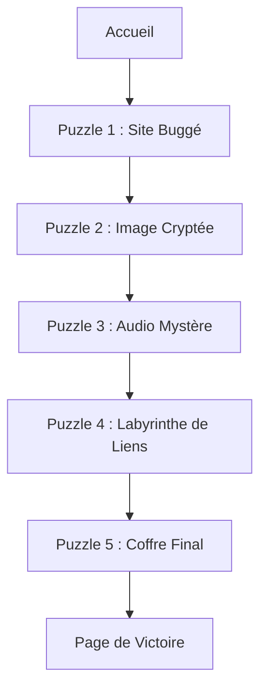

# Guide du Projet : Série de Puzzles CESI

## Description

Ce projet propose une série de puzzles interactifs conçus pour tester les compétences des utilisateurs en logique, observation et exploration. Chaque étape est un défi unique, culminant avec l'ouverture d'un coffre final pour accéder à la page de victoire.

---

## Contenu du Projet

### 1. **Puzzle 1 : Le Site "Buggé"**

- **But** : L'utilisateur doit inspecter le code source pour trouver un indice caché.
- **Explications** :
  - Le mot de passe est caché dans un commentaire HTML.
  - Une fois trouvé, l'utilisateur le saisit dans un champ pour progresser.

---

### 2. **Puzzle 2 : L'Image Cryptée**

- **But** : Un message est caché dans une image via **stéganographie**.
- **Explications** :
  - L'utilisateur doit analyser l'image (par exemple, télécharger et examiner les métadonnées ou utiliser un outil de stéganographie).
  - Une fois trouvé, le mot de passe est validé via un champ HTML.

---

### 3. **Puzzle 3 : Le Fichier Audio Mystère**

- **But** : L'utilisateur doit écouter un fichier audio pour extraire un mot de passe caché.
- **Explications** :
  - Le mot de passe est murmuré dans l'audio ou visible dans un spectrogramme.
  - regardez bien l'audio il n'est pas la ou on le pense

---

### 4. **Puzzle 4 : Le Labyrinthe de Liens**

- **But** : Plusieurs liens redirigent vers des impasses. Un seul est correct.
- **Explications** :
  - Les liens sont piégés, sauf un, qui est camouflé (texte transparent ou indice dans le code source).
  - L'utilisateur doit trouver le bon lien pour avancer.

---

### 5. **Puzzle 5 : Le Coffre Final**

- **But** : Combiner les solutions des puzzles précédents pour ouvrir le coffre final.
- **Explications** :
  - L'utilisateur assemble les mots de passe des puzzles 1, 2, et 3.
  - Une fois la bonne combinaison entrée, il est redirigé vers la page de victoire.

---

### **Page de Victoire**

- **But** : Célébrer la réussite de l'utilisateur !
- **Contenu** :
  - Un trophée.
  - Une animation festive (confettis 🎉).
  - Un message de félicitations.

---

## Structure des Fichiers

### **Arborescence**

```
/ (Racine)
├── index.html          # Page d'accueil
├── puzzle1.html        # Puzzle 1
├── puzzle2.html        # Puzzle 2
├── puzzle3.html        # Puzzle 3
├── puzzle4.html        # Puzzle 4
├── puzzle5.html        # Puzzle 5
├── victory.html        # Page de victoire
├── style/
│   └── style.css       # Feuille de style principale
├── scripts/
│   ├── puzzle1.js      # Script pour le Puzzle 1
│   ├── puzzle2.js      # Script pour le Puzzle 2
│   ├── puzzle3.js      # Script pour le Puzzle 3
│   ├── puzzle4.js      # Script pour le Puzzle 4
│   └── final-puzzle.js # Script pour le Coffre Final
├── img/
│   ├── logo-cesi.png   # Logo du CESI
│   ├── trophy.png      # Trophée pour la victoire
│   ├── audio-icon.png  # Icône pour le puzzle audio
│   └── classic.png     # Image cryptée
└── audio/
    └── mystery-audio.mp3 # Fichier audio pour le Puzzle 3
```

---

## Schéma du Projet



---

## Instructions

### 1. **Téléchargement et installation**

- Clonez le projet ou téléchargez les fichiers.
- Assurez-vous que tous les chemins (images, fichiers audio, scripts) sont corrects.

### 2. **Lancement du projet**

- Ouvrez `index.html` dans un navigateur pour commencer.

### 3. **Résolution des puzzles**

- Suivez les instructions sur chaque page pour progresser dans les défis.

### 4. **Personnalisation**

- Ajoutez vos propres indices ou puzzles si vous souhaitez modifier le jeu.
- Ajustez les couleurs et le style dans `style.css`.

---

## Remerciements

Ce projet a été conçu pour rendre hommage à l'école CESI et pour offrir une expérience ludique et éducative. Merci d'avoir joué !

😊 **Bonne chance et amusez-vous bien !**
